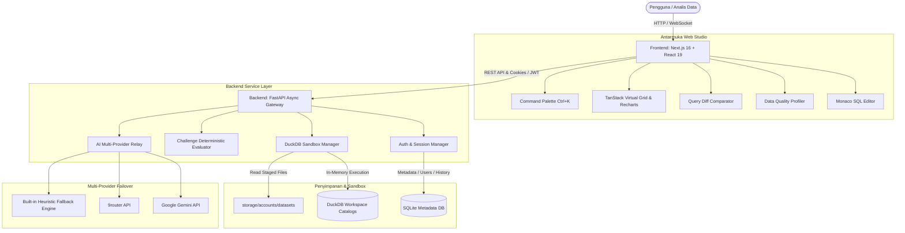

<div align="center">

# ⚡ SQL Data Lab v1.0
### Personal-to-Public Web SQL & Analytics Studio powered by DuckDB In-Memory Engine

[](https://github.com/)
[](https://duckdb.org/)
[](https://fastapi.tiangolo.com/)
[](https://nextjs.org/)
[](https://www.typescriptlang.org/)
[](https://tailwindcss.com/)
[](LICENSE)

<p align="center">
  <b>SQL Data Lab</b> adalah platform web analitik dan pelatihan SQL interaktif yang menggabungkan kecepatan komputasi analitik in-memory <b>DuckDB</b> dengan antarmuka <b>Retro Boxy 2D</b> (ala Windows klasik) yang bersih, ergonomis, dan bebas distraksi.
</p>

[Fitur Utama](#-fitur-utama) • [Arsitektur Sistem](#-arsitektur-sistem) • [Prasyarat](#-prasyarat-sistem) • [Panduan Instalasi](#-panduan-instalasi--eksekusi) • [Panduan Deploy Gratis (100% Free)](DEPLOY.md) • [Pintasan Keyboard](#-daftar-pintasan-keyboard) • [Akun Demo](#-akun-demo-bawaan) • [Konfigurasi .env](#-konfigurasi-environment-variable)

</div>

---

## 🌟 Mengapa SQL Data Lab?

Tradisional database relasional (seperti MySQL atau PostgreSQL) dirancang untuk transaksi baris (*OLTP*), sehingga kueri agregasi analitik pada dataset besar seringkali lambat dan membutuhkan konfigurasi server yang rumit. 

**SQL Data Lab** hadir dengan pendekatan berbeda:
* 🚀 **Zero Server Setup:** Cukup unggah file dataset tabular (CSV), dan DuckDB langsung memuatnya ke memori analitik secara instan.
* ⚡ **10x - 100x Lebih Cepat:** Menggunakan pemrosesan data ter-vektorisasi (*columnar vectorized execution*) untuk query agregasi data berskala besar.
* 🎨 **Retro Boxy 2D Aesthetics:** Desain kotak-kotak retro khas sistem operasi klasik yang tegas, responsif, dan nyaman untuk sesi kerja panjang (tersedia mode *Light* & *Dark*).
* 🛡️ **Sandbox Terisolasi:** Setiap workspace memiliki katalog analitik independen, pembatasan alokasi memori (*memory limits*), timeout kueri, dan sanitasi keamanan filesystem.

---

## 🏛️ Arsitektur Sistem



---

## 💎 Fitur Utama

| Modul | Deskripsi Kapabilitas |
| :--- | :--- |
| **Monaco SQL Studio** | Editor profesional dengan syntax highlighting, bracket-matching, auto-uppercase kata kunci, dan keyboard shortcuts. |
| **Smart Autocomplete** | Rekomendasi dinamis untuk tabel, kolom, fungsi SQL bawaan (*Window Functions*, agregasi), dan query snippets. |
| **Multi-Flavor SQL Formatter** | Format query instan dengan 5 preset: *Standar*, *Compact*, *Expanded*, *Tabular*, dan *Hanya UPPERCASE*. |
| **Data Quality Profiler** | Audit otomatis kesehatan data: deteksi baris duplikat, persentase data hilang (*null values*), kolom konstan, distribusi numerik & pencilan (*outliers*), skor mutu 0–100, serta tombol 1-klik muat SQL pembersih. |
| **Query Run Comparator** | Bandingkan 2 eksekusi query secara berdampingan: selisih durasi eksekusi (persentase delta performa), selisih baris, dan visual *SQL Line Diff* (+/-). |
| **Advanced Export Suite** | Ekspor fleksibel ke format CSV (koma / titik koma Excel), TSV (tab delimiter untuk salin langsung ke Google Sheets/Excel), Pipe, JSON, dan Markdown dengan opsi UTF-8 BOM. |
| **Visual Schema Explorer** | Struktur pohon data interaktif, preview tipe data kolom, jumlah baris, dan deteksi relasi antar-tabel (*relationship inference*). |
| **Interactive Results Grid** | Grid virtual TanStack Table untuk data berukuran besar, multi-column sorting, pagination cepat, dan visualisasi grafik (*Bar, Line, Area, Pie*). |
| **SQL Challenges & Evaluator** | Kasus latihan SQL interaktif dengan evaluasi hasil deterministik otomatis, perolehan XP, dan kenaikan tier ranking analis (*Novice* s/d *Grandmaster*). |
| **AI Assistant (Failover)** | Diagnosis error query, penjelasan kueri analitik, dan generator SQL teks-ke-query dengan fallback otomatis (Gemini ➔ 9router ➔ Heuristic Engine). |
| **Retro Boxy 2D UI** | Antarmuka berestetika 2D kotak-kotak Windows klasik, toggle tema Light & Dark, jam digital retro, dan panel responsif. |

---

## ⌨️ Daftar Pintasan Keyboard

Tingkatkan kecepatan analisis Anda dengan hotkeys bawaan:

| Pintasan Keyboard | Aksi | Konteks |
| :--- | :--- | :--- |
| **`Ctrl + K`** / **`Cmd + K`** | Membuka Global Command Palette (Aksi Cepat & Navigasi) | Kapan saja / Global |
| **`Ctrl + Enter`** / **`Cmd + Enter`** | Mengeksekusi Kueri SQL Aktif | Editor SQL |
| **`Ctrl + Space`** | Memicu Auto-complete Kata Kunci, Tabel & Kolom | Editor SQL |
| **`Shift + Alt + F`** | Merapikan Format Dokumen SQL Menggunakan Preset Aktif | Editor SQL |
| **`Esc`** | Menutup Modal, Drawer, atau Menu yang Sedang Terbuka | Modal / Drawer / Menu |

---

## 💻 Prasyarat Sistem

Sebelum memulai instalasi, pastikan lingkungan komputer Anda memenuhi spesifikasi berikut:

* **Python:** Versi 3.10, 3.11, atau 3.12 (teruji stabil pada Python 3.12).
* **Node.js:** Versi 18+, 20+, atau 24+ beserta `npm` (teruji pada Node v24).
* **Git:** Terpasang untuk kloning repositori.
* *(Opsional)* **Docker & Docker Compose:** Jika ingin menjalankan aplikasi secara terisolasi dalam kontainer.

---

## 🚀 Panduan Instalasi & Eksekusi

### Metode 1: Instalasi Lokal (Manual Setup)

#### 1. Kloning Repositori
```bash
git clone https://github.com/username/sqltrainweb.git
cd sqltrainweb
```

#### 2. Konfigurasi Backend (FastAPI + DuckDB)
Buka terminal dan masuk ke folder `backend`:
```bash
cd backend
```

Buat dan aktifkan virtual environment Python:
* **Windows (PowerShell):**
  ```powershell
  python -m venv .venv
  .\.venv\Scripts\Activate.ps1
  ```
* **Linux / macOS:**
  ```bash
  python3 -m venv .venv
  source .venv/bin/activate
  ```

Pasang dependensi Python:
```bash
pip install -r requirements.txt
```

Jalankan server backend:
```bash
python run.py
```
> Server backend akan berjalan di **`http://localhost:8000`**.  
> Dokumentasi interaktif Swagger UI dapat diakses di **`http://localhost:8000/docs`**.

---

#### 3. Konfigurasi Frontend (Next.js 16)
Buka terminal baru dan masuk ke folder `frontend`:
```bash
cd frontend
```

Pasang dependensi Node.js:
```bash
npm install
```

Jalankan server frontend dalam mode development:
```bash
npm run dev
```
> Antarmuka web SQL Data Lab dapat dibuka di browser melalui **`http://localhost:3000`**.

---

### Metode 2: Eksekusi Menggunakan Docker Compose

Jika sistem Anda telah terpasang Docker, Anda dapat menjalankan keseluruhan sistem (Backend & Frontend) dengan satu perintah dari root direktori proyek:

```bash
docker compose up --build
```

Layanan yang akan aktif:
* **Frontend Web Studio:** `http://localhost:3000`
* **Backend API & Docs:** `http://localhost:8000`

---

## 👤 Akun Demo Bawaan

Basis data metadata telah dipersiapkan dengan akun pengujian terkonfigurasi:

| Atribut | Nilai Kredensial |
| :--- | :--- |
| **Username** | `analyst_pro` |
| **Email** | `analyst@example.com` |
| **Password** | `Password123!` |
| **Workspace Bawaan** | `analyst_pro's Lab` |
| **Dataset Terpasang** | `customers` (Data profil pelanggan), `orders` (Data transaksi) |

> 💡 **Registrasi Mandiri:** Anda juga dapat membuat akun baru kapan saja melalui tombol **"Register"** di halaman login. Setiap akun baru otomatis memiliki workspace pribadi terisolasi.

---

## ⚙️ Konfigurasi Environment Variable

Aplikasi bekerja out-of-the-box dengan konfigurasi default. Jika ingin mengaktifkan integrasi AI eksternal atau mengatur batasan sandbox, buat file `.env` di root atau di dalam folder `backend`:

```env
# --- Identitas Aplikasi ---
APP_NAME="SQL Data Lab"
APP_VERSION="1.0.0"
ENVIRONMENT="development"
DEBUG=true

# --- Keamanan & Autentikasi ---
SECRET_KEY="ganti-dengan-kunci-rahasia-acak-minimal-32-karakter"
ACCESS_TOKEN_EXPIRE_MINUTES=10080

# --- Sandbox DuckDB ---
DUCKDB_MEMORY_LIMIT="1GB"
DUCKDB_THREADS=2
QUERY_TIMEOUT_SECONDS=20
MAX_UPLOAD_SIZE_BYTES=52428800

# --- Integrasi AI Assistant (Opsional) ---
AI_PROVIDER="auto"             # Pilihan: auto, gemini, 9router, openai_compatible
GEMINI_API_KEY=""              # Masukkan Google Gemini API Key jika tersedia
NINEROUTER_API_KEY=""          # Masukkan 9router API Key jika tersedia
```

---

## 📂 Struktur Direktori Proyek

```text
sqltrainweb/
├── backend/
│   ├── app/
│   │   ├── api/          # Route controller & endpoint API v1 (Auth, Datasets, SQL, Workspaces, dll.)
│   │   ├── core/         # Konfigurasi Pydantic, database engine, OWASP security & logging
│   │   ├── models/       # Skema ORM SQLAlchemy (User, Workspace, QueryHistory, SavedQuery, Challenge)
│   │   ├── schemas/      # Model validasi data Pydantic (Request & Response)
│   │   ├── services/     # DuckDB sandbox manager, Challenge evaluator, AI provider relay
│   │   └── main.py       # Entry point FastAPI, lifespan handler & middleware
│   ├── requirements.txt  # Daftar dependensi Python
│   └── run.py            # Script peluncur server Uvicorn
├── frontend/
│   ├── src/
│   │   ├── app/          # Halaman utama & layout Next.js App Router
│   │   ├── components/   # Komponen UI modular (SQLEditor, ResultsGrid, Modals, Drawers)
│   │   └── lib/          # Client API fetcher & formatter SQL
│   ├── package.json      # Dependensi dan script Node.js
│   └── tsconfig.json     # Konfigurasi TypeScript
├── storage/              # Direktori penyimpanan data lokal (SQLite metadata & dataset DuckDB)
├── sample_data/          # File CSV sampel siap pakai untuk latihan analitik
├── docker-compose.yml    # Konfigurasi Docker multi-container
└── README.md             # Dokumentasi utama proyek
```

---

## 🤝 Kontribusi

Kontribusi selalu disambut dengan baik! Jika Anda menemukan bug atau memiliki ide fitur baru:
1. **Fork** repositori ini.
2. Buat branch fitur baru (`git checkout -b fitur/fitur-keren`).
3. Commit perubahan Anda (`git commit -m 'Menambahkan fitur keren'`).
4. Push ke branch (`git push origin fitur/fitur-keren`).
5. Buka **Pull Request**.

---

## 📄 Lisensi

Proyek ini dilisensikan di bawah lisensi **MIT License** silakan gunakan, pelajari, dan kembangkan secara bebas untuk keperluan edukasi dan profesional.

---

<div align="center">
  <sub>Dibangun dengan dedikasi untuk komunitas analis data & SQL engineer. Dikembangkan dengan DuckDB, FastAPI & Next.js.</sub>
</div>
